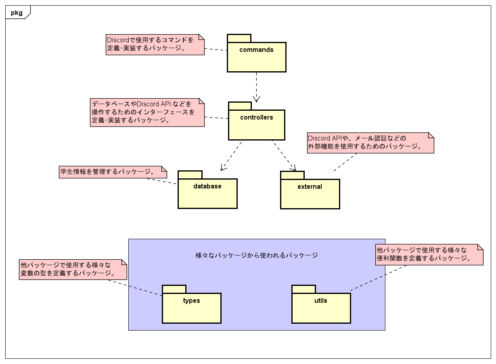

# 大内研究室 Discord Bot (discord-authbot2)

研究室の Discord サーバーに参加した人を、**事前登録された学生情報と大学メールアドレスで本人確認** し、
認証済みロール・学年ロールを付与する Bot です。
[discord-authbot](https://github.com/OhuchiLab/discord-authbot) (TypeScript 版) を参考に、Python で作り直しています。

## 1. 起動方法

```shell
python3 -m venv .venv
source .venv/bin/activate
pip install -r requirements.txt

cp .env.example .env   # .env を開いて各項目を設定する
python -m authbot
```

### 1.1 OS の起動時に自動で立ち上げる (Linux Mint / Ubuntu)

`.env` を作成したうえで、次のコマンドを実行します (管理者のパスワードを求められます)。
Bot は実行したユーザーの権限で動き、異常終了したときは自動で再起動します。

```shell
./scripts/install_service.sh          # 登録して、すぐに起動する
```

| やりたいこと | コマンド |
| --- | --- |
| 状態を見る | `sudo systemctl status authbot` |
| ログを見る | `journalctl -u authbot -f` |
| 再起動する (コードや .env を変更したとき) | `sudo systemctl restart authbot` |
| 止める | `sudo systemctl stop authbot` |
| 自動起動をやめる | `./scripts/uninstall_service.sh` |
| 登録内容を確認する (登録はしない) | `./scripts/install_service.sh --print` |

### 1.2 事前準備 (Discord Developer Portal)

1. Bot の設定で **Server Members Intent** を有効にする。
2. Bot をサーバーに招待する (権限: ロールの管理 / ニックネームの管理 / メッセージの送信、スコープ: `bot`, `applications.commands`)。
3. サーバー設定 > ロール で、Bot のロールを一番上の方 (Bot が付け外しするロールより上) に移動する。
4. 管理者に `Administrator` ロールを付ける (ロールは Bot の初回起動時に自動で作成されます)。

### 1.3 認証メールの送信設定

認証コードは SMTP で送信します。Gmail を使う場合は、2 段階認証を有効にしたうえで
[アプリパスワード](https://myaccount.google.com/apppasswords) を発行し、`.env` の `SMTP_PASSWORD` に設定してください。

## 2. 概要

| 誰が | 何をする | Bot の動き |
| --- | --- | --- |
| 管理者 | `/register` でメンバーの氏名・学籍番号・学年・メールアドレスを登録 | 学生情報をローカルのファイルに保存 |
| 新メンバー | サーバーに参加 | `Unauthorized` ロールを付け、DM で質問を開始 |
| 新メンバー | DM で氏名 → 学籍番号 → 学年 → メールアドレスを回答 | 登録内容と照合し、大学メールに 6 桁の認証コードを送信 |
| 新メンバー | DM で認証コードを送信 | ニックネームを氏名に変更し、`Authorized` と学年ロールを付与 |
| 管理者 | 年度の切り替え時に `/update_grades` を実行し、表示された候補 (B4 → M1 など) を確認・修正して確定 | 学生情報の学年を更新し、学年ロールを付け替える (卒業・修了した人は OB/OG ロール) |

その他のコマンド: `/auth` (認証手続きの再開・ロールの付け直し)、`/health_check` (死活確認)

学生情報は `data/students.msgpack` (設定で変更可) に保存され、Bot を再起動しても残ります。
**個人情報を含むため、このファイルは Git にコミットしないでください** (`.gitignore` 済み)。

## 3. ドキュメント

| 資料 | 内容 |
| --- | --- |
| [基本設計書](./docs/basic_design.md) | 目的、機能一覧、業務の流れ、データ、参考元との違い |
| [詳細設計書](./docs/detailed_design.md) | モジュールごとの処理、状態遷移、シーケンス、ファイル形式、エラー処理 |
| [テスト設計書](./docs/test_design.md) | テストの 4 階層、偽物の使い方、テスト駆動開発の手順、システムテスト手順書 |
| API ドキュメント | 下記コマンドで `docs/api/` に生成 (docstring から自動生成) |

```shell
pip install -r requirements-dev.txt
./scripts/generate_api_docs.sh     # docs/api/index.html をブラウザで開く
```

## 4. Package Map



上図の構成に加えて、Discord のイベント (メンバー参加・DM 受信・起動完了) を処理する `events` パッケージ (`commands` と並ぶ入口) と、
起動用の `main.py` / `bot.py` があります。最新の構成図は [基本設計書 10 章](./docs/basic_design.md#10-ソフトウェア構成) を参照してください。
依存の向きがパッケージマップどおりであることは、自動テスト (`tests/api/test_package_map.py`) で検査しています。

## 5. テスト

テスト駆動開発で開発します。テストは 4 階層に分かれています。詳しくは [テスト設計書](./docs/test_design.md) を参照してください。

| 階層 | 場所 | 内容 |
| --- | --- | --- |
| 単体 | `tests/unit/` | 1 モジュールの細かい振る舞い |
| API | `tests/api/` | パッケージの公開 I/F の約束事、パッケージマップどおりの依存か |
| 機能 | `tests/functional/` | 機能 F1〜F9 を、参加・DM・コマンドから通しで |
| システム | `tests/system/` + 手順書 | 本物の Discord と SMTP で動作確認 (リリース前) |

```shell
pip install -r requirements-dev.txt
python -m pytest              # 単体・API・機能テスト (システムテストは自動でスキップ)
python -m pytest -m unit      # 階層を指定して実行
```
