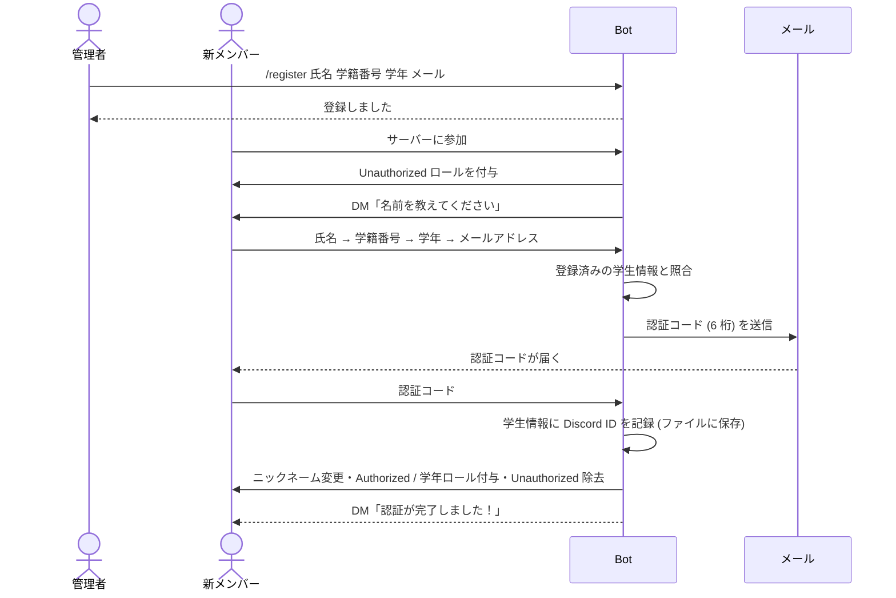
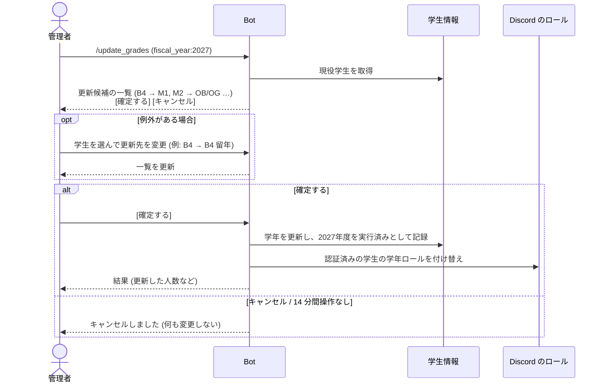
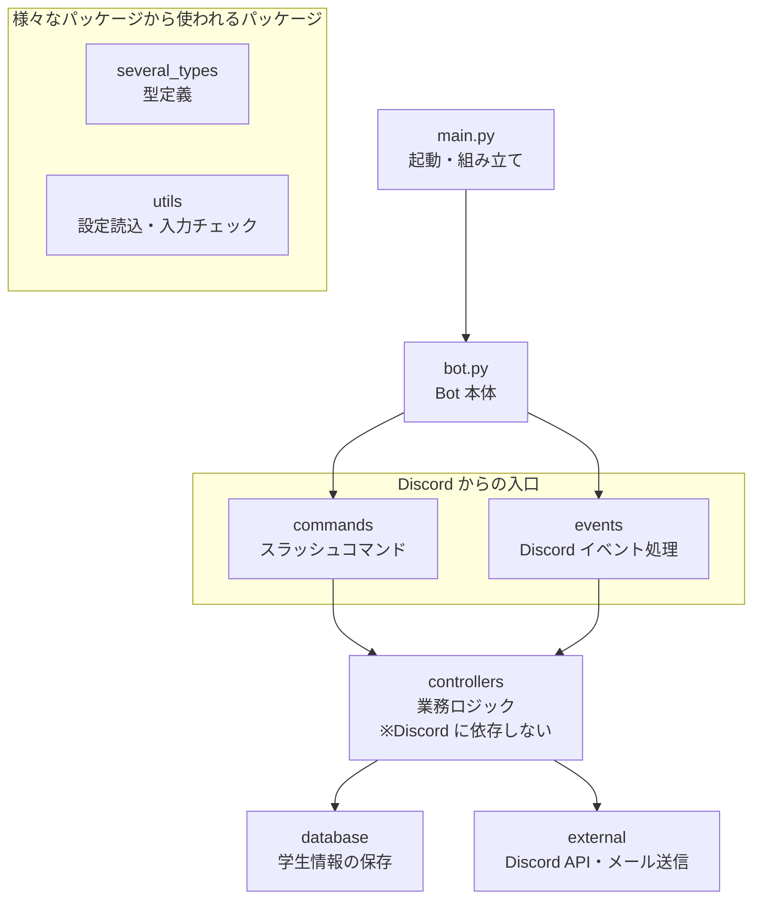

# 基本設計書 — 大内研究室 Discord 認証 Bot (discord-authbot2)

| 項目 | 内容 |
| --- | --- |
| 対象 | discord-authbot2 (Python 版) |
| 参考元 | [OhuchiLab/discord-authbot](https://github.com/OhuchiLab/discord-authbot) (TypeScript 版) |
| 関連資料 | [詳細設計書](./detailed_design.md) / [テスト設計書](./test_design.md) / API ドキュメント (`scripts/generate_api_docs.sh` で生成) |

---

## 1. 目的

研究室の Discord サーバーに参加した人が **研究室のメンバー本人であること** を確認し、
確認できた人にだけサーバーの利用権限 (ロール) を与える。

本人確認は次の 2 段階で行う。

1. 管理者が事前に登録した「氏名・学籍番号・学年・大学メールアドレス」と、本人が入力した内容が一致すること
2. その大学メールアドレスに届いた認証コードを、本人が Bot に送り返せること (= メールを受け取れる本人であること)

## 2. 用語

| 用語 | 意味 |
| --- | --- |
| サーバー (ギルド) | 研究室の Discord サーバー。Bot は 1 つのサーバーだけを対象にする |
| メンバー | サーバーに参加している Discord ユーザー |
| 学生情報 | 管理者が登録する、研究室メンバーの氏名・学籍番号・学年・メールアドレス |
| 認証 | 学生情報と Discord アカウントを紐付け、認証済みロールを与えること |
| 認証コード | 本人確認のためにメールで送る 6 桁の数字 |
| 管理者 | `Administrator` ロールを持つメンバー |
| 現役学生 | 学年が B4 / M1 / M2 / D1 / D2 / D3 の学生情報。OB/OG (卒業・修了済み) と TEACHER は含まない |
| 年度 | 日本の年度 (4 月始まり)。例: 2027年度 = 2027年4月〜2028年3月 |
| 現役更新 | 年度の切り替えに合わせて、現役学生の学年を 1 つ進めること (F9) |

## 3. システム構成

```mermaid
flowchart LR
    subgraph Discord
        U[メンバー] -- DM / スラッシュコマンド --> D[(Discord API)]
        A[管理者] -- /register --> D
    end
    subgraph 研究室のサーバー機
        B[認証 Bot<br/>Python / discord.py]
        F[(学生情報ファイル<br/>data/students.msgpack)]
    end
    M[SMTP サーバー<br/>例: Gmail]
    MB[大学メール<br/>@shizuoka.ac.jp]

    D <--> B
    B -- 読み書き --> F
    B -- 認証コード送信 --> M --> MB --> U
```

| 構成要素 | 説明 |
| --- | --- |
| 認証 Bot | 本プログラム。Python 3.12 + discord.py で動作する |
| 学生情報ファイル | Bot を動かす PC のディスク上に保存する (再起動しても消えない) |
| SMTP サーバー | 認証コードのメール送信に使う。Gmail などのアカウントを利用する |

## 4. 機能一覧

| No. | 機能 | 利用者 | きっかけ | 概要 |
| --- | --- | --- | --- | --- |
| F1 | 死活確認 | 全員 | `/health_check` | Bot が動いていれば "I'm alive!" と返す |
| F2 | 学生情報の登録 | 管理者 | `/register` | 氏名・学籍番号・学年・メールアドレスを登録する |
| F3 | 参加時の案内 | (自動) | サーバーへの参加 | 未認証ロールを付け、DM で認証手続きを始める |
| F4 | DM での認証手続き | 全員 | DM の送信 | 質問に順に答え、メールの認証コードで本人確認する |
| F5 | 認証完了の処理 | (自動) | F4 の完了 | ニックネームを氏名に変え、認証済みロール・学年ロールを付ける |
| F6 | 認証の再開 | 全員 | `/auth` | 未認証なら DM で手続きを始め直す。認証済みならロールを付け直す |
| F7 | 再参加時の自動復元 | (自動) | サーバーへの参加 | 過去に認証済みの人は、手続きなしでロールを付け直す |
| F8 | ロールの準備 | (自動) | Bot の起動 | 必要なロールが無ければサーバーに作成する |
| F9 | 現役メンバーの年度更新 | 管理者 | `/update_grades` | 現役学生の翌年度の学年を候補として表示し、管理者が確認・修正して確定すると、学生情報と学年ロールを更新する |
| F10 | 学生情報の手動変更 | 管理者 | `/edit_student` | 学籍番号かメンバーで指定した学生の氏名・学籍番号・学年・メールアドレスを変更する、または Discord との紐付けを解除する。変更前後を確認して確定すると、ニックネーム・ロールにも反映する |

## 5. ロール

| ロール名 | 付与されるタイミング | 用途 |
| --- | --- | --- |
| `Administrator` | 手動で付与 | `/register`・`/update_grades`・`/edit_student` を実行できる |
| `Unauthorized` | サーバー参加時 | 未認証メンバーの目印。認証完了時に外す |
| `Authorized` | 認証完了時 | 認証済みメンバーの目印 |
| `Grade:B4` 〜 `Grade:D3`, `Grade:TEACHER`, `Grade:OB/OG` | 認証完了時・現役更新の確定時 | 学年。学生情報の学年に対応するもの 1 つだけを付ける |

> チャンネルの閲覧権限などは、サーバー管理者がこれらのロールに対して Discord 上で設定する。
> Bot はロールの付け外しだけを行う。

**学生情報が正で、学年ロールはその結果を反映したものとする (学生情報 → ロール の一方向)。**
Discord 上でロールを手で付け外ししても学生情報は変わらず、現役更新の対象かどうかの判定にもロールは使わない。

## 6. 業務の流れ

### 6.1 全体の流れ



### 6.2 DM での認証手続き (F4)

| 順番 | Bot の質問 | 受け付ける入力 | 間違っていた場合 |
| --- | --- | --- | --- |
| 1 | 名前 (フルネーム) | 空でない文字列 | もう一度聞く |
| 2 | 学籍番号 | 英数字 8 文字 | もう一度聞く |
| 3 | 学年 | B4 / M1 / M2 / D1 / D2 / D3 / TEACHER / OB/OG | もう一度聞く |
| 4 | メールアドレス | `@shizuoka.ac.jp` のアドレス | もう一度聞く |
| — | (照合) | 1〜4 がすべて登録内容と一致 | 最初からやり直し |
| 5 | 認証コード | メールに記載の 6 桁 (10 分以内) | 5 回間違えたら最初からやり直し。期限切れはメールアドレスから |

- いつでも「やり直し」と送ると最初からやり直せる。
- 全角・半角、大文字・小文字、氏名中の空白の有無は区別しない。

### 6.3 現役メンバーの年度更新 (F9)



通常の進級規則 (更新候補の既定値):

| 今の学年 | 更新先の候補 |
| --- | --- |
| B4 | M1 |
| M1 | M2 |
| M2 | OB/OG |
| D1 | D2 |
| D2 | D3 |
| D3 | OB/OG |
| OB/OG・TEACHER | (対象外) |

- 管理者は確定前に、学生ごとに更新先を B4 / M1 / M2 / D1 / D2 / D3 / OB/OG から選び直せる (留年・卒業・進学など)。
- 年度を省略した場合は、今日が属する年度の次の年度とする (例: 2026年9月に実行 → 2027年度)。
- 確定するまで、学生情報・ロールは一切変更しない。
- 実行済みの年度は記録し、同じ年度で再度実行しようとすると「2027年度の現役更新は既に実行されています。」と警告して何もしない。
- 未認証の学生 (Discord アカウントと紐付いていない) も学生情報は更新する。ロールは認証時に新しい学年で付く。
- 卒業・修了 (OB/OG) になった学生は、学年ロールを外して `Grade:OB/OG` を付ける。

### 6.4 学生情報の手動変更 (F10)

1. 管理者が `/edit_student` を実行し、対象 (`student_number` か `member` のどちらか一方) と、変更する項目を指定する。
   - 変更できる項目: `new_name` (氏名)・`new_student_number` (学籍番号)・`new_grade` (学年)・`new_email` (メールアドレス)・`unlink_discord` (Discord との紐付け解除)
   - 値の形式と重複の確認は `/register` と同じ規則で行う。
2. Bot が変更前後 (例: 「学年: B4 → M1」) を表示する。この時点では何も変更しない。
3. 管理者が [確定する] を押すと学生情報を保存し、Discord に反映する。[キャンセル] または 14 分間操作が無ければ何も変更しない。

| 変更の内容 | Discord への反映 |
| --- | --- |
| 認証済みの学生の氏名・学年 | ニックネームを氏名に、学年ロールを学年に合わせて付け直す |
| Discord との紐付け解除 | そのアカウントの Authorized・学年ロールを外して Unauthorized を付ける。本人はもう一度認証できる |
| 学籍番号・メールアドレスだけ / 未認証の学生 | 反映しない (Discord に対応する情報が無いため) |

## 7. データ

### 7.1 学生情報 (永続化する)

| 項目 | 型 | 必須 | 説明 |
| --- | --- | --- | --- |
| uuid | 文字列 | ○ | 登録時に自動採番する ID |
| name | 文字列 | ○ | 氏名。認証後のニックネームにも使う |
| student_number | 文字列 | ○ | 学籍番号 (英数字 8 文字、大文字で保存) |
| email | 文字列 | ○ | 大学メールアドレス (小文字で保存) |
| grade | 文字列 | ○ | 学年 |
| discord_id | 文字列 | | 認証済みの Discord ユーザー ID。未認証なら空 |

- 保存先: Bot を動かす PC のローカルディスク (`data/students.msgpack`、変更可)。
- 形式: msgpack。学生情報の一覧と、現役更新を実行済みの年度を 1 つのファイルに保存する。
- 学年 `OB/OG` は、卒業・修了済みであることを表す。
- 学籍番号とメールアドレスは重複登録できない。1 つの Discord アカウントは 1 人の学生情報にしか紐付けられない。

### 7.2 認証手続きの途中経過 (永続化しない)

手続き中のユーザーの入力内容と認証コードはメモリ上だけに保持する。
Bot を再起動すると失われ、ユーザーは最初からやり直す (`/auth` または DM の送信で再開できる)。

## 8. 外部インターフェース

| 相手 | 方式 | 用途 |
| --- | --- | --- |
| Discord | Discord Bot API (discord.py) | イベント受信、DM 送受信、スラッシュコマンド、ロール・ニックネーム操作 |
| SMTP サーバー | SMTP (STARTTLS・ログインは設定で有無を選択。標準ライブラリ smtplib) | 認証コードのメール送信 |
| ローカルディスク | ファイル入出力 | 学生情報の保存・読み込み |

### 8.1 Bot に必要な Discord 側の設定

| 設定 | 値 |
| --- | --- |
| Privileged Gateway Intents | **Server Members Intent** を有効にする (参加イベントの受信に必要) |
| Bot の権限 | ロールの管理 / ニックネームの管理 / メッセージの送信 |
| ロールの順番 | Bot のロールを、Bot が付け外しするロールより **上** に置く |

## 9. 非機能要件

| 分類 | 方針 |
| --- | --- |
| 永続性 | 学生情報は変更のたびにファイルへ保存する。一時ファイルに書いてから置き換えるため、保存中に停止してもファイルは壊れない |
| セキュリティ | 認証コードは暗号論的乱数で生成し、有効期限 10 分・試行 5 回まで。学生情報ファイルは Git 管理外 (`.gitignore`)。`/register` の結果は実行者だけに見えるメッセージで返す |
| 設定の秘匿 | トークンや SMTP パスワードは `.env` に書き、Git 管理外とする |
| 規模 | 研究室の人数 (数十〜数百件) を想定し、全件をメモリに載せて検索する |
| 保守性 | 1 モジュール 1 役割とし、すべてのモジュール・クラス・関数に日本語の docstring を書く。業務ロジックは Discord に依存しない形で実装する |
| テスト | テスト駆動開発で開発し、単体・API・機能・システムの 4 階層でテストする ([テスト設計書](./test_design.md)) |

## 10. ソフトウェア構成

### 10.1 パッケージ構成 (パッケージマップ)



| パッケージ | 役割 |
| --- | --- |
| `commands` | Discord で使用するスラッシュコマンドを定義する。入力を `controllers` に渡して結果を応答するだけ |
| `events` | Discord から届くイベント (参加・DM・起動完了) を受け取り、`controllers` に渡すだけ |
| `controllers` | 業務ロジック。データベースや外部機能を組み合わせて処理を行う。Discord のオブジェクトは扱わない |
| `database` | 学生情報をファイルに保存・読み込みする |
| `external` | Discord API の操作 (DM・ロール・ニックネーム) と、メール送信を行う。Bot の外とのやり取りはすべてここを通す |
| `several_types` | 他パッケージで使用する型 (学生情報、学年、ロール定義など) を定義する |
| `utils` | 他パッケージで使用する便利関数 (設定読込、入力チェック) を定義する |

- `docs/images/package_map.png` の構成に、Discord イベントを受け取る `events` パッケージ (`commands` と並ぶ入口) と、
  起動用の `main.py`・`bot.py` を追加した。
- **依存の向きがこの図どおりであることは、自動テスト (`tests/api/test_package_map.py`) で常に検査する。**

### 10.2 使用ライブラリ

| ライブラリ | 用途 |
| --- | --- |
| discord.py | Discord Bot API |
| msgpack | 学生情報ファイルの読み書き |
| python-dotenv | `.env` からの設定読込 |
| pytest, pytest-asyncio (開発用) | 自動テスト |
| aiosmtpd (開発用) | APIテストで使うローカルの SMTP サーバー |
| pdoc (開発用) | docstring からの API ドキュメント生成 |

## 11. 参考元 (discord-authbot) との違い

| 観点 | discord-authbot (参考元) | discord-authbot2 (本システム) |
| --- | --- | --- |
| 言語 | TypeScript (discord.js) | Python (discord.py) |
| データベース | Firebase Firestore (クラウド) | ローカルディスク上のファイル (msgpack) |
| メール認証 | Firebase Auth の確認メール (リンクをクリック) | SMTP で 6 桁の認証コードを送信し、DM で返信してもらう |
| 認証完了のタイミング | メール確認後、サーバーで `/auth` を実行したとき | DM で正しい認証コードを送った時点 (追加操作不要) |
| `/auth` の役割 | 認証の完了処理 | 認証手続きの (再) 開始、認証済みならロールの付け直し |
| 再参加 | 再度手続きが必要 | 過去に認証済みなら自動でロールを復元 |
| 照合 | 完全一致 | 全角/半角・大文字/小文字・氏名の空白を無視して照合 |
| コマンドの反映 | `deployCommands` を別途実行 | Bot 起動時に自動で反映 |
| ドキュメント | 開発ルール中心 | 基本設計書・詳細設計書・テスト設計書・API ドキュメント (自動生成) |
| テスト | なし | 単体・API・機能・システムの 4 階層 |
| 学生情報の変更 | Firestore を直接編集 | `/edit_student` で変更し、ニックネーム・ロールに自動で反映 |
| 年度の切り替え | なし (手作業で学年ロールを付け替え) | `/update_grades` で学生情報を更新し、学年ロールに自動で反映 |
