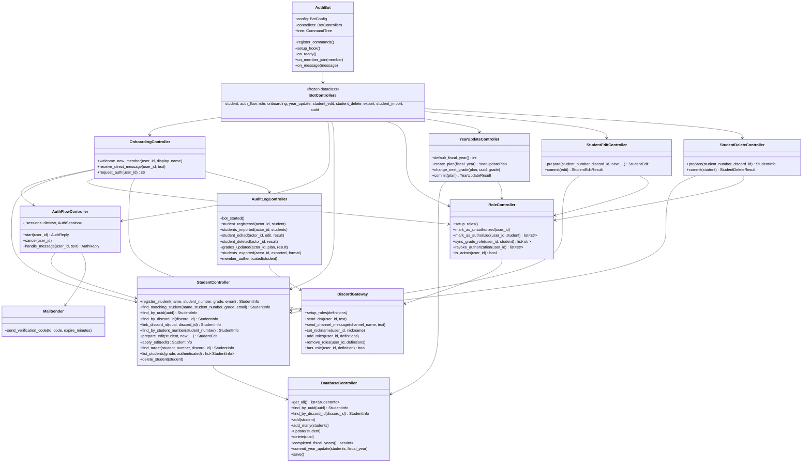
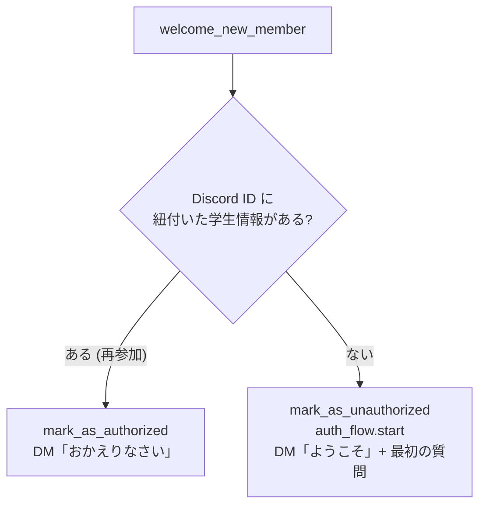
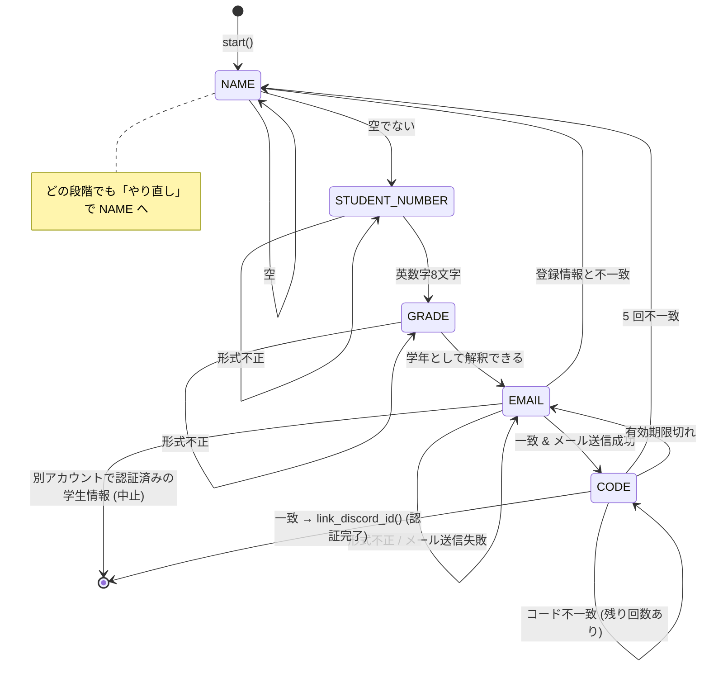
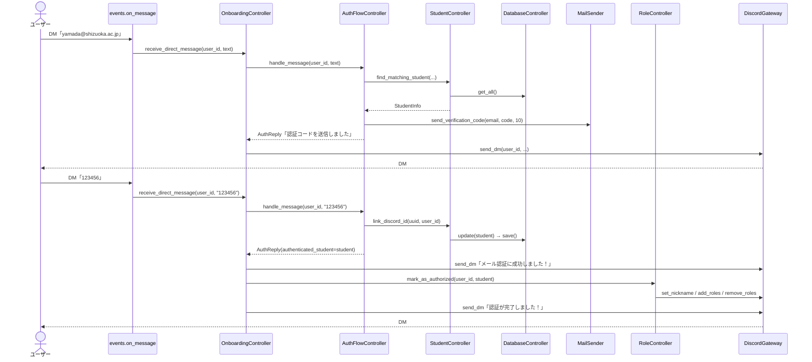
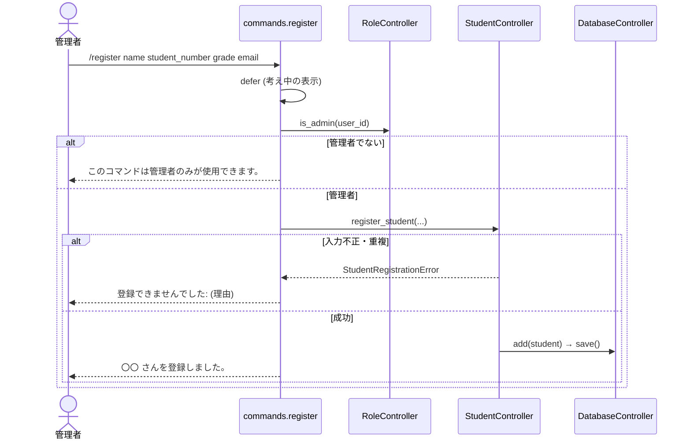

# 詳細設計書 — 大内研究室 Discord 認証 Bot (discord-authbot2)

| 項目 | 内容 |
| --- | --- |
| 関連資料 | [基本設計書](./basic_design.md) / [テスト設計書](./test_design.md) |
| API ドキュメント | `./scripts/generate_api_docs.sh` を実行すると `docs/api/index.html` に生成される (docstring から自動生成) |

本書は「どのファイルの、どの関数が、何をするか」を説明する。
引数・戻り値の細かい仕様は各関数の docstring (= API ドキュメント) を正とする。

---

## 1. ディレクトリ構成

```
discord-authbot2/
├── authbot/
│   ├── __main__.py            # `python -m authbot` の入口。src/ をインポート先に追加して main() を呼ぶ
│   └── src/
│       ├── main.py            # 設定を読み込み、各部品を組み立てて Bot を起動する
│       ├── bot.py             # Bot 本体 (AuthBot)。Discord のイベントを events へ振り分ける
│       ├── commands/          # スラッシュコマンド (1 コマンド 1 ファイル)
│       │   ├── health_check.py
│       │   ├── register.py
│       │   ├── auth.py
│       │   ├── grade_option.py        # 学年オプションの選択肢 (表示名付き)
│       │   ├── list_students.py       # /list_students
│       │   ├── list_students_view.py  # /list_students の一覧表示 (ページ切り替えのボタン)
│       │   ├── delete_student.py      # /delete_student
│       │   ├── delete_student_view.py # /delete_student の確認画面 (削除・キャンセルのボタン)
│       │   ├── export_students.py     # /export_students
│       │   ├── import_students.py     # /import_students
│       │   ├── import_students_view.py # /import_students の確認画面 (登録・キャンセルのボタン)
│       │   ├── edit_student.py        # /edit_student
│       │   ├── edit_student_view.py   # /edit_student の確認画面 (確定・キャンセルのボタン)
│       │   ├── update_grades.py       # /update_grades
│       │   └── update_grades_view.py  # /update_grades の確認画面 (ボタン・セレクトメニュー)
│       ├── events/            # Discord イベントの処理 (1 イベント 1 ファイル)
│       │   ├── on_ready.py
│       │   ├── on_member_join.py
│       │   └── on_message.py
│       ├── controllers/       # 業務ロジック (Discord に依存しない)
│       │   ├── audit_log_controller.py
│       │   ├── bot_controllers.py
│       │   ├── export_controller.py
│       │   ├── import_controller.py
│       │   ├── onboarding_controller.py
│       │   ├── auth_flow_controller.py
│       │   ├── student_controller.py
│       │   ├── student_edit_controller.py
│       │   ├── student_delete_controller.py
│       │   ├── role_controller.py
│       │   └── year_update_controller.py
│       ├── database/          # 学生情報の保存
│       │   ├── database_controller.py
│       │   └── database_backup.py
│       ├── external/          # 外部機能 (Discord API・SMTP)
│       │   ├── discord_gateway.py
│       │   └── mail_sender.py
│       ├── several_types/     # 型定義
│       │   ├── grade.py
│       │   ├── student_info.py
│       │   ├── auth_session.py
│       │   ├── exported_file.py
│       │   ├── role_definition.py
│       │   ├── student_edit.py
│       │   ├── student_import.py
│       │   └── year_update.py
│       └── utils/             # 便利関数
│           ├── config.py
│           └── validators.py
├── tests/                     # 自動テスト (テスト設計書を参照)
│   ├── fakes/                 # 偽物 (テストダブル)
│   ├── unit/                  # 単体テスト
│   ├── api/                   # APIテスト
│   ├── functional/            # 機能テスト
│   └── system/                # システムテスト
├── scripts/
│   └── generate_api_docs.sh   # API ドキュメント生成
├── docs/                      # 設計書
├── data/                      # 学生情報ファイルの既定の保存先 (Git 管理外)
├── .env.example               # 設定ファイルのひな形
├── requirements.txt           # 実行に必要なライブラリ
├── requirements-dev.txt       # 開発に必要なライブラリ
└── pyproject.toml             # pytest の設定
```

### 1.1 インポートの規則

- `authbot/src/` を基準に、パッケージ名から直接インポートする (例: `from database import DatabaseController`)。
  - 起動時は `authbot/__main__.py`、テスト時は `pyproject.toml` の `pythonpath` が `authbot/src/` をインポート先に追加する。
- パッケージの外からは、各パッケージの `__init__.py` が公開しているものだけを使う。
- 依存の向きはパッケージマップ ([基本設計書 10 章](./basic_design.md#10-ソフトウェア構成)) に従う。
  **この規則は `tests/api/test_package_map.py` で自動検査される。**

| パッケージ | import してよいパッケージ | discord.py |
| --- | --- | --- |
| `main` | bot, controllers, database, external, several_types, utils | × |
| `bot` | commands, events, controllers, several_types, utils | ○ |
| `commands` / `events` | controllers, several_types, utils (bot は型注釈のみ) | ○ |
| `controllers` | database, external, several_types, utils | **×** |
| `database` / `external` | several_types, utils | external のみ ○ |
| `several_types` | なし | × |
| `utils` | several_types | × |

- `commands` / `events` は `bot.AuthBot` を型注釈にだけ使う (`if TYPE_CHECKING:` の中で import)。循環インポートを避けるため。

### 1.2 層ごとの責務

| 層 | パッケージ | 責務 | やってはいけないこと |
| --- | --- | --- | --- |
| 入口 | `commands`, `events` | Discord の入力からユーザー ID や文字列を取り出して `controllers` に渡し、結果を応答する | 業務の判断 (認証済みか、何を返すか等) |
| 業務ロジック | `controllers` | 何をするかを決める | Discord のオブジェクトを扱うこと |
| 外部機能 | `database`, `external` | ファイル・Discord API・SMTP を操作する | 業務の判断 |

## 2. クラス図



## 3. モジュール詳細

### 3.1 起動処理

#### `authbot/__main__.py`

`python -m authbot` で実行される。`authbot/src/` を `sys.path` の先頭に追加し、`main.main()` を呼ぶ。

#### `main.py` — `main()`

1. ログ出力を設定する (INFO 以上、`時刻 [レベル] モジュール名: メッセージ`)。
2. `utils.load_config()` で設定を読む。読み込む .env ファイルは環境変数 `AUTHBOT_ENV_FILE` で変更できる (既定 `.env`)。`ConfigError` なら内容をログに出して終了コード 1 で終了。
3. `AuthBot(config)` を作る。
4. `DatabaseController`・`MailSender`・`DiscordGateway(bot, guild_id)` を作る。
5. `controllers.build_controllers()` でコントローラー一式を作り、`bot.controllers` に設定する。
6. `bot.run()` で Discord に接続する (停止するまで戻らない)。

> `DiscordGateway` は Bot 本体を使って Discord を操作するため、Bot を先に作り、コントローラーは後から設定する。
> 機能テスト (`tests/functional/conftest.py`) も同じ手順で組み立て、`DiscordGateway` と `MailSender` だけを偽物にする。

#### `bot.py` — `AuthBot(discord.Client)`

| メソッド | 呼ばれるとき | 処理 |
| --- | --- | --- |
| `__init__` | 起動時 | Intents に `members` を追加。`CommandTree` を作る |
| `register_commands` | `setup_hook` から (機能テストからも直接) | `commands.setup_all_commands()` でコマンドを `tree` に登録 |
| `setup_hook` | ログイン直後 1 回 | `register_commands()` → `tree.sync(guild=...)` で対象サーバーにコマンドを反映 |
| `on_ready` | 準備完了 | `events.handle_ready()` |
| `on_member_join` | メンバー参加 | `events.handle_member_join()` |
| `on_message` | メッセージ受信 | `events.handle_message()` |

### 3.2 `commands` パッケージ

各モジュールは `setup_xxx_command(bot)` を持ち、その中でコマンドを `bot.tree` に登録する。
コマンドは対象サーバー専用 (ギルドコマンド) として登録するため、DM では使えない。

`commands/__init__.py` の `setup_all_commands(bot)` がすべてのコマンドを登録し、共通のエラー処理
(想定外の例外 → ログ出力し「コマンドの実行中にエラーが発生しました。」と返す) を設定する。

| コマンド | ファイル | 引数 | 処理 |
| --- | --- | --- | --- |
| `/health_check` | `health_check.py` | なし | "I'm alive!" と返す |
| `/register` | `register.py` | `name`, `student_number`, `grade` (選択式), `email` | `defer` → `RoleController.is_admin()` → `StudentController.register_student()` → 結果を返す |
| `/auth` | `auth.py` | なし | `defer` → `OnboardingController.request_auth()` の戻り値を返す |
| `/delete_student` | `delete_student.py` | 対象: `student_number` または `member` (どちらか一方) | `defer` → `RoleController.is_admin()` → `StudentDeleteController.prepare()` → 確認画面 (`StudentDeleteView`) を表示 |
| `/import_students` | `import_students.py` | `file` (CSV の添付、必須) | `defer` → `RoleController.is_admin()` → 拡張子 (.csv) と大きさ (1MB まで) の確認 → `ImportController.parse()` → 問題があれば一覧を表示 (最大 20 件、2000 文字以内)、無ければ確認画面 (`StudentImportView`) を表示 |
| `/export_students` | `export_students.py` | `format` (CSV / msgpack、省略すると CSV) | `defer` → `RoleController.is_admin()` → `ExportController.export_csv()` / `export_msgpack()` → ファイルを添付して返す。誰が書き出したかをログに残す |
| `/edit_student` | `edit_student.py` | 対象: `student_number` または `member` (どちらか一方)<br/>変更: `new_name`, `new_student_number`, `new_grade` (選択式), `new_email`, `unlink_discord` (真偽値) | `defer` → `RoleController.is_admin()` → `StudentEditController.prepare()` → 確認画面 (`StudentEditView`) を表示 |
| `/list_students` | `list_students.py` | `grade` (選択式、省略可), `status` (認証済み / 未認証、省略可) | `defer` → `RoleController.is_admin()` → `StudentController.list_students()` → 一覧 (`StudentListView`) を表示。該当者がいなければ「条件に合う学生はいません。」 |
| `/update_grades` | `update_grades.py` | `fiscal_year` (年度。整数 2000〜2100、省略可) | `defer` → `RoleController.is_admin()` → `YearUpdateController.create_plan()` → 確認画面 (`YearUpdateView`) を表示 |

- 応答はすべて ephemeral (実行者だけに見える) とする。`/register` は個人情報を含むため特に必須。
- 管理者用のコマンドは、説明文を「【管理者用】」で始める。説明文は Discord の上限 (100 文字) 以内とする (`tests/api/test_commands_api.py` で検査)。
- 学年のオプションは `grade_option.GradeOption` を型に使う。Discord には「OB/OG (卒業・修了)」「教員 (TEACHER)」のような表示名の選択肢として表示され、処理には `Grade` として渡される。
- Discord はコマンドに 3 秒以内の応答を求めるため、Discord の操作を伴うコマンドは先に `defer` (「考え中」表示) し、`followup` で結果を返す。

#### `list_students_view.py` — `StudentListView(discord.ui.View)`

`/list_students` の一覧表示。先頭に「全 N 人 (認証済み X 人 / 未認証 Y 人)」、続けて 1 人 1 行で
「氏名 | 学籍番号 | 学年 | メールアドレス | Discord (メンション、未認証なら「未認証」)」を表示する。

- 1 ページ 20 人 (`PAGE_SIZE`)。1 ページに収まる場合はボタンを付けない。
- `show_page(interaction, page)`: ◀ 前へ / 次へ ▶ ボタンから呼ばれ、ページを切り替える。
- `interaction_check(interaction)`: `/list_students` を実行した管理者以外の操作は受け付けない。

#### `import_students_view.py` — `StudentImportView(discord.ui.View)`

`/import_students` の確認画面。登録する学生を「氏名 | 学籍番号 | 学年 | メールアドレス」(登録される形に正規化して) で最大 30 人表示し、
それより多い分は「…ほか N 人」とまとめる。操作 (`confirm` = 登録する / `cancel` / `on_timeout` / `interaction_check`) は `StudentEditView` と同じ。
`describe_errors(errors)` は CSV の問題の一覧を、Discord のメッセージの上限に収まるように作る。

#### `delete_student_view.py` — `StudentDeleteView(discord.ui.View)`

`/delete_student` の確認画面。削除する学生情報のすべての項目と、「この操作は取り消せません」という注意を表示する。
認証済みの人なら、Discord 上で未認証に戻ることも表示する。操作 (`confirm` = 削除する / `cancel` / `on_timeout` / `interaction_check`) は `StudentEditView` と同じ。

#### `edit_student_view.py` — `StudentEditView(discord.ui.View)`

`/edit_student` の確認画面。変更された項目だけを「学年: B4 → M1」の形で表示する。紐付けを解除する場合は、その影響の説明も表示する。

| 操作部品 | メソッド | 処理 |
| --- | --- | --- |
| (表示) | `render()` | 変更前後の一覧を埋め込み表示にする |
| 確定する | `confirm(interaction)` | `StudentEditController.commit()` の結果 (またはエラー) を表示する |
| キャンセル | `cancel(interaction)` | 何も変更せず「キャンセルしました」と表示する |
| (14 分間操作なし) | `on_timeout()` | キャンセルと同じ |
| (全操作) | `interaction_check(interaction)` | `/edit_student` を実行した管理者以外の操作は受け付けない |

#### `update_grades_view.py` — `YearUpdateView(discord.ui.View)`

`/update_grades` の確認画面。表示と操作の受け付けだけを行い、判断は `YearUpdateController` に任せる。
操作部品は、受け取った操作を次のメソッドに渡すだけにしている (機能テストからも同じメソッドで操作する)。

| 操作部品 | メソッド | 処理 |
| --- | --- | --- |
| (表示) | `render()` | 今のページの更新候補を埋め込み表示にする。「@メンション 氏名 / B4 → M1」、留年・卒業・変更には目印 |
| 学生のセレクトメニュー | `select_student(interaction, uuid)` | 更新先を変更する学生を選ぶ。更新先のセレクトメニューが現れる |
| 更新先のセレクトメニュー | `select_next_grade(interaction, grade)` | `YearUpdateController.change_next_grade()` |
| ◀ 前へ / 次へ ▶ | `show_page(interaction, page)` | 25 人ごとのページを切り替える (Discord のセレクトメニューは 25 個まで) |
| 確定する | `confirm(interaction)` | 画面を「更新しています…」にし、`YearUpdateController.commit()` の結果 (またはエラー) を表示する |
| キャンセル | `cancel(interaction)` | 何も変更せず「キャンセルしました」と表示する |
| (14 分間操作なし) | `on_timeout()` | キャンセルと同じ。Discord の応答の有効期限 (15 分) より前に画面を書き換える |
| (全操作) | `interaction_check(interaction)` | `/update_grades` を実行した管理者以外の操作は受け付けない |

### 3.3 `events` パッケージ

いずれも Discord のオブジェクトから値を取り出して `controllers` に渡すだけで、判断は行わない。

| 関数 | 無視する条件 | 呼び出す処理 |
| --- | --- | --- |
| `on_ready.handle_ready(bot)` | — | `RoleController.setup_roles()` |
| `on_member_join.handle_member_join(bot, member)` | Bot 自身 / 対象外のサーバー | `OnboardingController.welcome_new_member(str(member.id), member.display_name)` |
| `on_message.handle_message(bot, message)` | 送信者が Bot / サーバー内の投稿 (`message.guild` が None でない) | `OnboardingController.receive_direct_message(str(author.id), content)` |

### 3.4 `controllers` パッケージ

**Discord に依存しない。** Discord の操作は `external.DiscordGateway` に、ユーザー ID (文字列) とロール定義だけを渡して行う。

#### `bot_controllers.py`

- `BotControllers` — コントローラー一式 (`student`, `auth_flow`, `role`, `onboarding`) を持つ frozen dataclass。
- `build_controllers(database, mail_sender, discord_gateway, allowed_email_domain)` — 一式を組み立てる。
  本番・APIテスト・機能テストで共通に使う。

#### `onboarding_controller.py` — `OnboardingController`

参加から認証完了までの一連の流れを担当する。

| メソッド | 機能 | 処理 |
| --- | --- | --- |
| `welcome_new_member(user_id, display_name)` | F3 / F7 | 認証済み → `mark_as_authorized()` + DM「おかえりなさい」<br/>未認証 → `mark_as_unauthorized()` + `auth_flow.start()` + DM「ようこそ」 |
| `receive_direct_message(user_id, text)` | F4 / F5 | `auth_flow.handle_message()` の返答を DM で送る。認証が完了したら `AuditLogController.member_authenticated()` で記録し、`mark_as_authorized()` し完了を DM で送る。サーバーにいない (`MemberNotFoundError`) なら参加を案内 |
| `request_auth(user_id) -> str` | F6 | 認証済み → `mark_as_authorized()` し、その旨を返す<br/>未認証 → `auth_flow.start()` を DM で送る。DM を拒否されたら (`DiscordPermissionError`) 手続きを `cancel()` し、設定変更の案内を返す |

DM を拒否しているメンバーへの DM 送信 (`DiscordPermissionError`) は、警告ログだけ出して処理を続ける。



#### `auth_flow_controller.py` — `AuthFlowController`

DM での認証手続きを進める。文字列を受け取り、返答の文字列 (`AuthReply`) を返すだけで、送信はしない。

定数:

| 定数 | 値 | 意味 |
| --- | --- | --- |
| `CODE_EXPIRE_MINUTES` | 10 | 認証コードの有効期限 (分) |
| `MAX_CODE_ATTEMPTS` | 5 | 認証コードを間違えられる回数 |
| `RESTART_KEYWORDS` | やり直し / やりなおし / リセット / RESET | 手続きを最初からやり直す合言葉 |

保持するデータ:

- `_sessions: dict[str, AuthSession]` — Discord ユーザー ID ごとの途中経過 (メモリのみ)。
- `_locks: dict[str, asyncio.Lock]` — 同じユーザーのメッセージを 1 通ずつ順に処理するためのロック。
  メール送信の待ち時間中に次のメッセージが届いても、二重に処理しないようにする。

`handle_message(user_id, text)` の処理:

1. ユーザーのロックを取得する。
2. 入力を NFKC 正規化し、前後の空白を除く (全角英数字 → 半角)。
3. 途中経過が無い場合: 認証済みなら「すでに認証済みです。」、そうでなければ `start()` (内容は無視)。
4. 入力が `RESTART_KEYWORDS` のどれか (大文字小文字無視) なら `start()`。
5. 現在の段階 (`AuthStep`) に対応する `_receive_xxx()` を呼ぶ。

状態遷移:



各段階の処理:

| メソッド | 段階 | 成功時の処理 | 返答 (成功時) |
| --- | --- | --- | --- |
| `_receive_name` | NAME | `session.name` に保存 | 学籍番号を教えてください。 |
| `_receive_student_number` | STUDENT_NUMBER | `utils.is_valid_student_number()` で確認し保存 | 学年を以下から教えてください: … |
| `_receive_grade` | GRADE | `Grade.parse()` で変換し保存 | 大学のメールアドレス (@…) を教えてください。 |
| `_receive_email` | EMAIL | 1. 形式確認<br/>2. `find_matching_student()` で照合<br/>3. 他アカウントで認証済みでないか確認<br/>4. 認証コードを生成し `MailSender` で送信<br/>5. `student_uuid`・`code`・`code_expires_at` を保存、失敗回数を 0 に | 〇〇 に認証コードを送信しました。… |
| `_receive_code` | CODE | 1. 有効期限を確認<br/>2. `secrets.compare_digest()` でコードを比較<br/>3. 途中経過を破棄し `link_discord_id()` | メール認証に成功しました！ (+ `authenticated_student`) |

認証コードは `secrets.randbelow()` で生成する 6 桁の数字 (`000000`〜`999999`)。
テストのため、現在時刻を返す関数 (`now`) とコード生成関数 (`code_generator`) をコンストラクタで差し替えられる。

#### `student_controller.py` — `StudentController`

| メソッド | 処理 | 例外 |
| --- | --- | --- |
| `register_student` | 1. 氏名が空でないこと、学籍番号が英数字 8 文字、メールが許可ドメインであることを確認<br/>2. 学籍番号・メールアドレスの重複を確認 (正規化して比較)<br/>3. uuid4 を採番し、学籍番号は大文字・メールは小文字にそろえて `DatabaseController.add()` | `StudentRegistrationError` |
| `find_matching_student` | 全件から 氏名・学籍番号・学年・メール がすべて一致するものを返す (正規化して比較) | — |
| `find_by_uuid` / `find_by_discord_id` | `DatabaseController` の同名メソッドを呼ぶ | — |
| `list_students(grade=None, authenticated=None)` | 学生情報の一覧を、学年順 (`Grade` の定義順)・同じ学年の中は学籍番号順で返す。学年と認証の状態 (Discord と紐付いているか) で絞り込める | — |
| `register_students(entries)` | `find_registration_problems()` で全員を確認し、問題が無ければ `DatabaseController.add_many()` で 1 回の保存でまとめて登録する。`register_student()` もこれを使う | `StudentRegistrationError` (1 人でも問題があれば何も登録しない) |
| `find_registration_problems(entries)` | 1 人ずつ、形式・登録済みとの重複・一緒に登録する学生どうしの重複を調べ、`{添字: 問題}` を返す。登録はしない | — |
| `find_by_student_number` | 学籍番号が一致する学生情報を返す (正規化して比較) | — |
| `find_target(student_number=None, discord_id=None)` | 管理者が指定した対象を、学籍番号か Discord ID のどちらか一方で探す (`/edit_student`・`/delete_student` で共通) | `StudentNotFoundError` (指定が 0 個・2 個 / 見つからない) |
| `delete_student(student)` | 保存されている学生情報が `student` と同じか (確認中に変更・削除されていないか) を確認して `DatabaseController.delete()` | `StudentDeleteError` |
| `prepare_edit(student, new_name, new_student_number, new_grade, new_email, unlink_discord)` | None の項目は変えずに変更後の `StudentInfo` を作り、`StudentEdit` (変更前・変更後) を返す。形式・重複 (自分自身を除く) を `register_student` と同じ規則で確認する。**保存はしない** | `StudentEditError` (変更なし / 形式不正 / 重複 / 紐付いていないのに解除) |
| `apply_edit(edit)` | 保存されている学生情報が `edit.before` と同じか (確認中に変更されていないか) と、重複を再確認して `DatabaseController.update()` | `StudentEditError` |
| `link_discord_id` | 1. 学生情報が存在すること<br/>2. その学生情報が別の Discord ID に紐付いていないこと<br/>3. その Discord ID が別の学生情報に紐付いていないこと<br/>を確認し、`discord_id` を設定して `DatabaseController.update()` | `StudentLinkError` |

例外のメッセージは、そのまま Discord 上の利用者に表示する文章とする。

#### `role_controller.py` — `RoleController`

「どのロールを付ける/外すか」を決め、操作は `DiscordGateway` に任せる。

| メソッド | 処理 | 失敗時 |
| --- | --- | --- |
| `setup_roles()` | `DiscordGateway.setup_roles(ALL_ROLES)` | サーバー未参加・権限不足はエラーログのみ |
| `mark_as_unauthorized(user_id)` | `Unauthorized` を付ける | 権限不足はエラーログのみ |
| `mark_as_authorized(user_id, student)` | 1. ニックネームを `student.name` に<br/>2. `Authorized` を付け、`Unauthorized` を外す<br/>3. `sync_grade_role()` | 権限不足は利用者向けの説明を戻り値のリストに入れ、残りの処理は続ける。サーバーにいなければ `MemberNotFoundError` |
| `revoke_authorization(user_id)` | `Authorized` と学年ロールを外し、`Unauthorized` を付ける (紐付け解除時)。他のロール・ニックネームは変えない | 権限不足は説明を返す。サーバーにいなければ `MemberNotFoundError` |
| `sync_grade_role(user_id, student)` | 学生情報の学年のロールだけを付け、他の学年ロール (OB/OG を含む) を外す。ニックネームは変えない | 権限不足は説明を返す。サーバーにいなければ `MemberNotFoundError` |
| `is_admin(user_id)` | `Administrator` ロールを持っていれば `True` | サーバーにいなければ `False` |

#### `student_edit_controller.py` — `StudentEditController`

学生情報の手動変更 (F10) の流れを担当する。

| メソッド | 処理 | 例外 (`StudentEditError`) |
| --- | --- | --- |
| `prepare(student_number=None, discord_id=None, new_...)` | 対象をどちらか一方で探し、`StudentController.prepare_edit()` で変更内容を作る | 対象の指定が 0 個・2 個 / 見つからない / 変更内容が不正 |
| `commit(edit)` | `StudentController.apply_edit()` で保存し、Discord に反映する:<br/>・紐付け解除 → 以前のアカウントに `RoleController.revoke_authorization()`<br/>・認証済みで氏名か学年が変わる → `RoleController.mark_as_authorized()` (ニックネーム・学年ロール)<br/>・それ以外 → 反映しない | 確認中に変更された / 重複が生じた (いずれも何も変更しない) |

戻り値 `StudentEditResult` には、変更後の学生情報、Discord に反映したか、サーバーにいなかったか、うまくいかなかった説明が入る。
Discord への反映に失敗しても学生情報の変更は取り消さない。

#### `audit_log_controller.py` — `AuditLogController`

変更履歴のログ (F16) を担当する。操作ごとのメソッドで文章を作り、`DiscordGateway.send_channel_message()` でログ用チャンネルに投稿する。

- 呼び出す場所: 確認画面のある操作 (変更・削除・年度更新・一括登録) は確認画面 (`*_view.py`) の `confirm()` で確定に成功した後、
  `/register`・`/export_students` はコマンドの成功後、認証完了は `OnboardingController.receive_direct_message()`、Bot の起動は `events.on_ready`。
  **確定した操作だけを記録する** (キャンセル・エラーでは呼ばない)。
- 操作した管理者は `actor_id` (Discord ユーザー ID) で受け取り、`<@ID>` で書く (投稿時に通知は飛ばない)。
- 文章は 1 行目に「絵文字 操作名: 誰が 何を どうした」、2 行目以降に全角空白で字下げして詳細を書く。
  変更前後は `StudentEdit.describe_changes()`、年度更新の内容は `YearUpdateCandidate.transition_text()` を使う (確認画面と同じ書き方)。
- 2000 文字 (`MAX_MESSAGE_LENGTH`) を超える場合は、行の区切りで複数のメッセージに分ける。
- `channel_name` が None なら何もしない。投稿に失敗しても (`DiscordOperationError`)、警告ログを出すだけで例外は出さない。

#### `import_controller.py` — `ImportController`

CSV からの一括登録 (F15) を担当する。

| 定数 | 内容 |
| --- | --- |
| `REQUIRED_COLUMNS` | 必要な列: 氏名, 学籍番号, 学年, メールアドレス |
| `ENCODINGS` | 試す文字コード: `utf-8-sig` (BOM の有無どちらも) → `cp932` (Shift_JIS) |
| `MAX_ROWS` | 1 回で登録できる人数 (500) |

| メソッド | 処理 | 例外 (`StudentImportError`) |
| --- | --- | --- |
| `parse(data)` | 1. 文字コードを判定して読む<br/>2. 1 行目の見出しから列の位置を決める<br/>3. 空の行を飛ばし、学年を `Grade.parse()` で読む (読めなければその行の問題)<br/>4. CSV の中での学籍番号・メールアドレスの重複を調べる (後の行を問題とし、「N 行目と同じ」と示す)<br/>5. 残りを `StudentController.find_registration_problems()` で調べる<br/>→ `StudentImportPlan` (登録する行と、行番号順の問題の一覧) を返す。**登録はしない** | 空 / 文字コード / 列が足りない / 学生がいない / 多すぎる |
| `commit(plan)` | 問題が無ければ `StudentController.register_students()` で全員をまとめて登録する | 計画に問題がある / 確認中に重複が生じた (いずれも何も登録しない) |

#### `export_controller.py` — `ExportController`

学生情報の書き出し (F13) を担当する。ファイル名は `students-YYYYMMDD.csv` / `.msgpack` (日付は `today` で差し替え可)。

| メソッド | 中身 |
| --- | --- |
| `export_csv()` | 見出し「氏名, 学籍番号, 学年, メールアドレス, Discord ID, uuid」+ 1 人 1 行。並び順は `/list_students` と同じ (`student_controller.sort_students()`)。Excel で文字化けしないよう BOM 付き UTF-8、改行は CRLF |
| `export_msgpack()` | `DatabaseController.dump()` (学生情報ファイルとまったく同じ内容)。そのまま学生情報ファイルとして復元に使える |

#### `student_delete_controller.py` — `StudentDeleteController`

学生情報の削除 (F12) の流れを担当する。

| メソッド | 処理 | 例外 (`StudentDeleteError`) |
| --- | --- | --- |
| `prepare(student_number=None, discord_id=None)` | `StudentController.find_target()` で対象を探す | 対象の指定が 0 個・2 個 / 見つからない |
| `commit(student)` | `StudentController.delete_student()` で削除し、認証済みなら `RoleController.revoke_authorization()` で未認証の状態に戻す | 確認中に変更・削除された (何も変更しない) |

戻り値 `StudentDeleteResult` には、削除した学生情報、Discord を変更したか、サーバーにいなかったか、うまくいかなかった説明が入る。
Discord の変更に失敗しても学生情報の削除は取り消さない。

#### `year_update_controller.py` — `YearUpdateController`

現役メンバーの年度更新 (F9) を担当する。学生情報が正で、Discord のロールはその結果を反映する (一方向)。

定数:

| 定数 | 内容 |
| --- | --- |
| `DEFAULT_NEXT_GRADES` | 通常の進級規則。B4→M1, M1→M2, M2→OB/OG, D1→D2, D2→D3, D3→OB/OG。**ここにある学年の学生を「現役学生」とする** |
| `SELECTABLE_NEXT_GRADES` | 管理者が選べる更新先。B4, M1, M2, D1, D2, D3, OB/OG |
| `FISCAL_YEAR_START_MONTH` | 年度が始まる月 (4) |

| メソッド | 処理 | 例外 (`YearUpdateError`) |
| --- | --- | --- |
| `default_fiscal_year()` | 今日が属する年度 (4 月始まり) の次の年度 | — |
| `create_plan(fiscal_year=None)` | 現役学生ごとに `YearUpdateCandidate` (今の学年・既定の更新先・更新先) を作り、`YearUpdatePlan` にまとめる。**学生情報・ロールは変更しない** | 実行済みの年度 / 現役学生がいない |
| `change_next_grade(plan, uuid, grade)` | 計画の中の 1 人の更新先を変える | 選べない学年 |
| `commit(plan)` | 1. 年度が実行済みでないか再確認 (他の管理者が先に確定した場合)<br/>2. 計画を作った後に現役学生の顔ぶれ・学年が変わっていないか確認<br/>3. `DatabaseController.commit_year_update()` で学生情報の更新と年度の記録をまとめて保存<br/>4. 認証済みの学生について `RoleController.sync_grade_role()` | 実行済みの年度 / 学生情報が変わった (いずれも何も変更しない) |

`commit()` の戻り値 `YearUpdateResult` には、更新した人数、ロールを同期した人数、サーバーにいなかった学生の氏名、ロールを付け替えられなかった説明が入る。
ロールの同期に失敗しても学生情報の更新は取り消さない (学生情報が正のため。ロールは `/auth` で付け直せる)。

### 3.5 `database` パッケージ

#### `database_controller.py` — `DatabaseController`

- 生成時にファイルを読み込み、全件を `list[StudentInfo]` としてメモリに持つ。ファイルが無ければ空。
- 追加・更新のたびに `save()` でファイル全体を書き直す。
- 入力チェックや重複判定は行わない (`StudentController` の責務)。ただし uuid の重複追加と、存在しない uuid の更新は例外にする。
- `delete(uuid)` は学生情報を削除して保存する。存在しない uuid は `KeyError`。
- `add_many(students)` は複数の学生情報をまとめて追加し、1 回だけ保存する (バックアップも 1 つ)。uuid が重複すれば `ValueError` で何も追加しない。
- 現役更新を実行済みの年度 (`completed_fiscal_years()`) も同じファイルに保存する。
- `commit_year_update(students, fiscal_year)` は、学生情報の置き換えと年度の記録を **1 回の保存でまとめて** 行う。
  年度が実行済み (`ValueError`) や存在しない uuid (`KeyError`) の場合は何も変更しない。

`save()` の手順 (保存中に停止してもファイルが壊れないようにする):

1. 保存先のフォルダが無ければ作る。
2. 同じフォルダに一時ファイル (`.tmp-xxxx`) を作り、msgpack で書き込む。
3. `flush()` と `os.fsync()` でディスクへの書き込みを確定させる。
4. `os.replace()` で本来のファイル名に置き換える (置き換えは一瞬で行われる)。
5. 途中で失敗したら一時ファイルを削除し、例外をそのまま投げる。

#### `database_backup.py` — `DatabaseBackup` (F14)

- `DatabaseBackup(backup_dir, keep)`: `create(source)` で `backup_dir/<元の名前>-<YYYYMMDD-HHMMSS-マイクロ秒><拡張子>` のコピーを作り、
  同じ元ファイルのコピーのうち新しい `keep` 個を残して古いものを消す。コピーも一時ファイル経由で作るため、途中で止まっても壊れたコピーは残らない。
- `DatabaseController(filepath, backup)` に渡すと、**起動時 (ファイルがあれば) と `save()` のたび** にコピーを作る。
- `open_database(filepath, backup_dir, backup_keep)`: 設定に合わせて `DatabaseController` を作る。`backup_dir` が None か `backup_keep` が 0 ならバックアップを取らない。
  `main.py` と機能テストの `BotDriver` はこの関数で組み立てる。
- `DatabaseController.dump()`: ファイルに書き込む内容 (msgpack のバイト列) を返す。`save()` と `/export_students` (msgpack) で使う。

**復元の手順**

1. Bot を止める (`sudo systemctl stop authbot`、または `Ctrl+C`)。
2. 戻したいコピーを学生情報ファイルに上書きする。
   ```shell
   ls data/backups/                                                    # 日時で選ぶ
   cp data/backups/students-20270301-093015-123456.msgpack data/students.msgpack
   ```
   `/export_students format:msgpack` で受け取ったファイルも、同じように上書きして使える。
3. Bot を起動する。起動時に、復元した状態のコピーが新しく作られる。

#### 学生情報ファイルの形式

**この形式は `tests/api/test_database_api.py` で検査される。変更する場合は既存ファイルの移行方法も用意すること。**

- ファイル: 設定 `DATABASE_PATH` (既定 `data/students.msgpack`)
- 形式: msgpack。中身は次の辞書 (学生情報は `StudentInfo.to_dict()` / `from_dict()` で変換)。

```json
{
  "format_version": 2,
  "students": [
    {
      "uuid": "3f1c2a9e-…",
      "name": "山田 太郎",
      "student_number": "AB123456",
      "email": "yamada.taro.21@shizuoka.ac.jp",
      "grade": "M1",
      "discord_id": "123456789012345678"
    }
  ],
  "completed_fiscal_years": [2027]
}
```

- 以前の形式 (上の `students` の配列だけのファイル) も読み込める。次に保存したときに新しい形式になる。

| キー | 型 | 備考 |
| --- | --- | --- |
| `grade` | str | `Grade` の値 (`B4`, `M1`, `M2`, `D1`, `D2`, `D3`, `TEACHER`, `OB/OG`) |
| `format_version` | int | ファイル形式のバージョン (現在 2) |
| `discord_id` | str または nil | 未認証なら nil。読み込み時にキーが無い場合も `None` として扱う |
| `completed_fiscal_years` | int の配列 | 現役更新を実行済みの年度 (小さい順) |

内容を確認したいときは次のように読める:

```shell
python -c "import msgpack, pprint; pprint.pprint(msgpack.unpack(open('data/students.msgpack', 'rb')))"
```

### 3.6 `external` パッケージ

Bot の外 (Discord・SMTP サーバー) とのやり取りはすべてこのパッケージを通す。

#### `discord_gateway.py` — `DiscordGateway`

`DiscordGateway(client, guild_id)` — 1 つのサーバーを対象に Discord API を操作する。
引数はユーザー ID (文字列) と `RoleDefinition` だけで、Discord のオブジェクトを呼び出し側に出さない。

| メソッド | 処理 |
| --- | --- |
| `setup_roles(definitions)` | 名前が一致するロールが無ければ作成する |
| `send_dm(user_id, text)` | ユーザーに DM を送る (サーバーに参加していなくても送れる) |
| `send_channel_message(channel_name, text)` | 名前が一致するテキストチャンネルに投稿する。本文のメンションで通知が飛ばないよう `AllowedMentions.none()` を付ける |
| `set_nickname(user_id, nickname)` | ニックネームを変更する |
| `add_roles(user_id, definitions)` | ロールを付与する。サーバーに無いロールは作成する |
| `remove_roles(user_id, definitions)` | 持っているロールだけを外す |
| `has_role(user_id, definition)` | ロールを持っているか返す |

discord.py の例外は、次の例外に変換して送出する (すべて `DiscordOperationError` のサブクラス)。

| 例外 | 状況 | 元の discord.py の例外・状態 |
| --- | --- | --- |
| `GuildNotFoundError` | Bot が対象サーバーに参加していない | `client.get_guild()` が None |
| `MemberNotFoundError` | ユーザーがサーバーにいない / 存在しない | `discord.NotFound` |
| `ChannelNotFoundError` | その名前のテキストチャンネルが無い | `discord.utils.get(guild.text_channels, ...)` が None |
| `DiscordPermissionError` | Bot に権限が無い / DM を拒否されている | `discord.Forbidden` |

メンバーは キャッシュ (`guild.get_member`) → API (`guild.fetch_member`) の順に探す。

#### `mail_sender.py` — `MailSender`

- `MailSender(host, port, mail_from, user=None, password=None, use_starttls=True)`
- `send_verification_code(to_address, code, expire_minutes)`: 件名「【大内研究室 Discord】認証コードのお知らせ」で、コードと有効期限を本文に書いたメールを送る。
- SMTP 通信 (`_send`) はブロッキング処理のため `asyncio.to_thread()` で別スレッドで実行し、その間も Bot は他の処理を続けられるようにする。
- 接続手順: `SMTP(host, port, timeout=30)` → (`use_starttls` なら) `starttls()` → (`user` があれば) `login()` → `send_message()`。
- `smtplib.SMTPException` / `OSError` は `MailSendError` に変換して投げる。

### 3.7 `several_types` パッケージ

| モジュール | 定義 | 説明 |
| --- | --- | --- |
| `grade.py` | `Grade` (Enum) | 学年。`parse()` は大文字小文字・前後空白を無視し、`OBOG` も `OB/OG` として受け付ける |
| `student_info.py` | `StudentInfo` (frozen dataclass) | 学生情報 1 件。変更は `dataclasses.replace()` で新しいインスタンスを作る |
| `auth_session.py` | `AuthStep` (Enum), `AuthSession` (dataclass) | 認証手続きの段階と途中経過 |
| `role_definition.py` | `RoleDefinition` と各ロール定数 | ロール名・色の一覧。**ロールの変更はこのファイルだけで行う** |
| `student_edit.py` | `StudentEdit`, `StudentEditResult`, `StudentDeleteResult` (frozen dataclass), `FIELD_LABELS` | 手動変更の内容 (変更前・変更後) と結果、削除の結果。`changed_fields()` は変わる項目の表示名、`unlinks_discord` は紐付けを解除する変更か |
| `student_import.py` | `NewStudent`, `ImportRow`, `StudentImportPlan` (frozen dataclass) | 登録する学生 1 人分の入力内容、CSV の 1 行 (行番号付き)、CSV を読み取った結果 (登録する行と問題の一覧) |
| `exported_file.py` | `ExportedFile` (frozen dataclass) | 書き出したファイル (ファイル名・中身・人数) |
| `year_update.py` | `YearUpdateCandidate`, `YearUpdatePlan` (dataclass), `YearUpdateResult` (frozen dataclass) | 現役更新の候補 (1 人分)・計画 (一覧)・確定結果。`is_changed` は既定の更新先から変更されたか |

### 3.8 `utils` パッケージ

#### `config.py` — `load_config(env_file=Path(".env"))`

`.env` を読み込み (すでに設定されている環境変数が優先)、`BotConfig` を返す。

| 環境変数 | 必須 | 既定値 | 説明 |
| --- | --- | --- | --- |
| `DISCORD_TOKEN` | ○ | | Bot のトークン |
| `GUILD_ID` | ○ | | 対象サーバーの ID (整数) |
| `DATABASE_PATH` | | `data/students.msgpack` | 学生情報ファイル (相対パスは起動時のカレントディレクトリ基準) |
| `ALLOWED_EMAIL_DOMAIN` | | `shizuoka.ac.jp` | 受け付けるメールアドレスのドメイン |
| `SMTP_HOST` | ○ | | SMTP サーバー |
| `SMTP_PORT` | | `587` | SMTP ポート (整数) |
| `SMTP_USE_STARTTLS` | | `true` | STARTTLS で暗号化するか (`true` / `false`) |
| `SMTP_USER` | | (ログインしない) | SMTP ユーザー名 |
| `SMTP_PASSWORD` | | | SMTP パスワード |
| `MAIL_FROM` | `SMTP_USER` が無ければ ○ | `SMTP_USER` | 差出人アドレス |
| `BACKUP_DIR` | | `data/backups` | バックアップの保存先。ディスクの故障に備えるなら外付けディスクや NAS を指定する |
| `LOG_CHANNEL_NAME` | | `authbot-logs` | 変更履歴を投稿するチャンネル名。空 (`LOG_CHANNEL_NAME=`) にすると投稿しない |
| `BACKUP_KEEP` | | `50` | 残すバックアップの数 (0 以上の整数。0 ならバックアップを取らない) |

必須項目が無い、または整数・真偽値であるべき項目の形式が不正な場合は `ConfigError`。

#### `validators.py`

| 関数 | 仕様 |
| --- | --- |
| `normalize_input(text)` | NFKC 正規化 + 前後の空白除去 |
| `is_valid_student_number(s)` | 正規化後、`^[A-Za-z0-9]{8}$` に一致 |
| `is_valid_email(email, domain)` | 正規化後、最後の `@` で分割し、ローカル部が `[A-Za-z0-9._%+-]+`、ドメインが `domain` と完全一致 (大文字小文字無視。サブドメインは不可) |
| `normalize_name(name)` | 正規化後、空白 (全角含む) をすべて除去 |
| `normalize_student_number(s)` | 正規化後、大文字に |
| `normalize_email(email)` | 正規化後、小文字に |

## 4. 処理シーケンス

### 4.1 メールアドレス入力 〜 認証完了



### 4.2 `/register`



## 5. エラー処理一覧

| 発生箇所 | 状況 | 対処 | 利用者への表示 |
| --- | --- | --- | --- |
| 起動 | 必須の環境変数が無い | ログ出力し終了 (終了コード 1) | — |
| 起動 | Bot が対象サーバーに未参加 | エラーログ (ロール作成をしない) | — |
| ロール作成・付与 | Bot に権限が無い | エラーログ | 認証完了時のみ「ロールを付与できませんでした。管理者に連絡してください。」 |
| ニックネーム変更 | 対象がオーナー / 上位ロール | 警告ログ、ロール付与は続行 | 「ニックネームを変更できませんでした。…」 |
| DM 送信 (参加時) | 相手が DM を拒否 | 警告ログ | (送れないため無し。`/auth` で再開可能) |
| DM 送信 (`/auth`) | 相手が DM を拒否 | 途中経過を破棄 | プライバシー設定の案内 |
| メール送信 | SMTP エラー・接続失敗 | 例外ログ、EMAIL 段階に留まる | 「認証メールの送信に失敗しました。…」 |
| 紐付け | 別アカウントと紐付け済み | 手続きを中止 | 「…管理者に連絡してください。」 |
| 認証完了時 | ユーザーがサーバーに未参加 | ロール付与をしない (参加時に F7 で自動付与) | 「サーバーに参加すると自動で付与されます。」 |
| スラッシュコマンド | 想定外の例外 | 例外ログ | 「コマンドの実行中にエラーが発生しました。」 |
| データベース保存 | ディスク書き込み失敗 | 一時ファイルを削除し例外を投げる (元のファイルは変更されない) | コマンドの場合は上記の共通エラー |

## 6. ログ

- 形式: `時刻 [レベル] ロガー名: メッセージ` (ロガー名 = モジュール名)
- 個人情報の出力方針: 氏名・学籍番号はログに出さない。Discord ユーザー ID・学生情報の uuid・送信先メールアドレスのみ出す。

| レベル | 主な内容 |
| --- | --- |
| INFO | 起動、コマンド同期、ロール作成、学生登録、メール送信、認証完了 |
| WARNING | DM 送信不可、ニックネーム変更不可 |
| ERROR | 設定不足、権限不足、想定外の例外 |

## 7. テスト

テストの階層・書き方・実行方法は [テスト設計書](./test_design.md) を参照。

## 8. 拡張のしかた

新しい機能は [テスト設計書 5 章](./test_design.md#5-テスト駆動開発の進め方) の手順で、テストから先に書く。

| やりたいこと | 変更する場所 |
| --- | --- |
| スラッシュコマンドを追加する | `commands/` にファイルを追加し、`commands/__init__.py` の `setup_all_commands()` に登録処理を追加。処理の中身は `controllers` に書く |
| Discord の新しい操作を使う | `external/discord_gateway.py` にメソッドを追加し、`tests/fakes/fake_discord_gateway.py` にも同じメソッドを追加 (`tests/api/test_fakes_contract.py` が一致を検査する) |
| 学年を追加する | `several_types/grade.py` の `Grade` と、`several_types/role_definition.py` の `GRADE_ROLES` |
| ロール名・色を変える | `several_types/role_definition.py` (既存サーバーのロール名は手動で合わせる) |
| DM の文言を変える | `controllers/auth_flow_controller.py` (手続き中)、`controllers/onboarding_controller.py` (参加時・完了時) |
| 認証コードの有効期限・試行回数を変える | `controllers/auth_flow_controller.py` の定数 |
| 進級規則・選べる更新先を変える | `controllers/year_update_controller.py` の `DEFAULT_NEXT_GRADES` / `SELECTABLE_NEXT_GRADES` |
| 学生情報に項目を追加する | `several_types/student_info.py` (`to_dict` / `from_dict` も。既存ファイルとの互換のため `from_dict` では `data.get()` で既定値を与える) と `tests/api/test_database_api.py` |
| パッケージを追加する・依存を変える | パッケージマップ (基本設計書・`docs/images/package_map.png`) と `tests/api/test_package_map.py` の `ALLOWED_DEPENDENCIES` |
