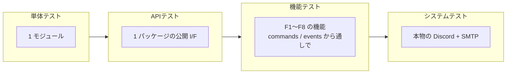
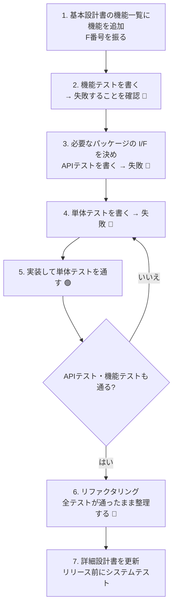

# テスト設計書 — 大内研究室 Discord 認証 Bot (discord-authbot2)

| 項目 | 内容 |
| --- | --- |
| 関連資料 | [基本設計書](./basic_design.md) / [詳細設計書](./detailed_design.md) |
| テストツール | pytest (+ pytest-asyncio、aiosmtpd) |

---

## 1. 方針

- テスト駆動開発 (TDD) で開発する。**機能を追加・変更するときは、先にテストを書いて失敗することを確認してから実装する。**
- テストは **単体 → API → 機能 → システム** の 4 階層に分け、階層ごとにディレクトリを分ける。
- Discord と SMTP サーバーは、単体・API・機能テストでは偽物 (テストダブル) に置き換え、誰の PC でも数秒で全テストが終わるようにする。
  本物を使うのはシステムテストだけとする。

## 2. テストの階層



| 階層 | ディレクトリ | テストの対象 | 本物を使うもの | 偽物にするもの | 実行 |
| --- | --- | --- | --- | --- | --- |
| 単体 | `tests/unit/<パッケージ>/` | 1 つのモジュール (クラス・関数) の細かい振る舞いと境界値 | 対象のモジュール、値オブジェクト (`several_types`, `utils`)、副作用の無いコントローラー | ファイル (`InMemoryDatabase`)、Discord、SMTP、時計 | 常に |
| API | `tests/api/` | 1 つのパッケージが `__init__.py` で公開している I/F の約束事 (契約) | パッケージの内部と、その下の層 (`database` は一時フォルダの実ファイル、`MailSender` はローカルの SMTP サーバー) | Discord (本物が無いため) | 常に |
| 機能 | `tests/functional/` | 基本設計書の機能 F1〜F15 を、利用者の操作 (参加・DM・コマンド) から結果 (ロール・DM・ファイル) まで通しで | `AuthBot`・`commands`・`events`・`controllers`・`database` (実ファイル) | `DiscordGateway`、`MailSender`、Discord から渡されるオブジェクト | 常に |
| システム | `tests/system/` + 本書 7 章の手順書 | 本物の環境で Bot 全体が動くこと | すべて (テスト用 Discord サーバー、テスト用 SMTP) | なし | リリース前に手動で |

### 2.1 各階層で確認すること / しないこと

| 階層 | 確認すること | 確認しないこと (他の階層に任せる) |
| --- | --- | --- |
| 単体 | 分岐・境界値・例外の変換など、モジュール内部の細かい振る舞い | 他のパッケージと組み合わせたときの動き |
| API | パッケージの公開 I/F の約束事: ファイル形式、例外の種類、SMTP の手順。**パッケージマップどおりの依存 (`test_package_map.py`)**、**偽物と本物の I/F の一致 (`test_fakes_contract.py`)** | 細かい分岐 (単体で確認済み) |
| 機能 | 利用者から見た振る舞い (どの操作で、どの DM が届き、どのロールが付き、何が保存されるか) | 文言の細部・境界値 (単体で確認済み) |
| システム | 本物の Discord の権限・Intents・コマンド登録、本物のメールが届くこと | 業務ロジック (機能テストまでで確認済み) |

## 3. ディレクトリ構成と命名規則

```
tests/
├── conftest.py                 # 階層マーカー (unit / api / functional / system) を自動で付ける
├── fakes/                      # 偽物 (テストダブル)。4 章を参照
├── unit/                       # 単体テスト: authbot/src と同じパッケージ構成にする
│   ├── controllers/test_<モジュール名>.py
│   ├── database/ ...
│   ├── external/ ...
│   ├── several_types/ ...
│   └── utils/ ...
├── api/                        # APIテスト: test_<パッケージ名>_api.py
│   ├── test_package_map.py     # パッケージマップどおりの依存か
│   └── test_fakes_contract.py  # 偽物が本物と同じ I/F か
├── functional/                 # 機能テスト: test_f<機能番号>_<機能名>.py
│   └── conftest.py             # BotDriver (Bot を操作する道具)
└── system/                     # システムテスト: test_system_*.py
    └── conftest.py             # 本物の Discord にログインした Bot
```

- ファイルの先頭の docstring に、`[単体]` `[API]` `[機能]` `[システム]` のいずれかと、対象を書く。
- テスト関数名は **日本語で「何をしたら、どうなるか」** を書く (例: `test_登録情報と一致しなければ最初からやり直し`)。
  失敗したときに、テスト名だけで何が壊れたかがわかるようにするため。
- 1 つのテストでは 1 つの振る舞いを確認する。準備 → 実行 → 確認 の順に、空行で区切って書く。

## 4. 偽物 (テストダブル) 一覧

すべて `tests/fakes/` にあり、`from tests.fakes import ...` で使う。

| 偽物 | 本物 | 内容 | 主な使い方 |
| --- | --- | --- | --- |
| `FakeDiscordGateway` | `external.DiscordGateway` | サーバーのロール・メンバー・送った DM をメモリに記録する | `add_member(user_id, roles=..., accepts_dm=False)` で準備し、`members[user_id].roles` や `last_dm(user_id)` で確認。`can_manage_roles = False` で権限不足を再現 |
| `FakeMailSender` | `external.MailSender` | 送ったメールを記録する | `last_code()` で認証コードを取り出す。`fail = True` で送信失敗を再現 |
| `InMemoryDatabase` | `database.DatabaseController` | 学生情報をメモリだけに持つ | 単体テストでファイルを使わずに済ませる |
| `FakeClock` | 現在時刻 (`datetime.now`) | 時刻を進められる | `advance(minutes=10)` で有効期限切れを再現 |
| `FakeDiscordMember` ほか (`discord_inputs.py`) | Discord から渡されるオブジェクト | Bot が使う属性だけを持つ | 機能テストの `BotDriver` が使う |

**偽物は本物と同じ I/F でなければならない。** `tests/api/test_fakes_contract.py` が、公開メソッドの名前・引数・async かどうかの一致を検査する。
本物にメソッドを追加・変更したら、偽物も同じように変更すること。

### 4.1 機能テストの道具 `BotDriver`

`tests/functional/conftest.py` の `driver` フィクスチャで使える。本物の `AuthBot` を `main.py` と同じ手順で組み立てる (ログインはしない)。

| メソッド | 再現する操作 |
| --- | --- |
| `member_joins(user_id, display_name)` | サーバーへの参加 |
| `send_dm(user_id, text)` → 最後に届いた DM | Bot への DM |
| `post_in_server(user_id, text)` | サーバーのチャンネルへの投稿 |
| `run_command(user_id, "register", name=..., ...)` → 応答 | スラッシュコマンドの実行 (応答が ephemeral であることも確認する) |
| `run_command_for_response(...)` → `SentResponse` | 同上。埋め込み表示 (`embed`) や確認画面 (`view`) も確認したいとき |
| `component_interaction(user_id)` | ボタン・セレクトメニューの操作を再現するインタラクション (`view.confirm(...)` などに渡す) |
| `add_student(name, 学籍番号, grade, discord_id=None)` | 学生情報を登録する。`discord_id` を指定すると、認証済みでサーバーにいる状態にする |
| `saved_grade(student)` | 学生情報ファイルに保存されている学年 |
| `today` (属性) | Bot から見た今日の日付。年度の既定値のテストで変更する |
| `bot_becomes_ready()` | Bot の準備完了 |
| `restart_bot()` | Bot の再起動 (学生情報ファイルと Discord の状態はそのまま) |
| `register_yamada()` / `answer_questions_as_yamada(user_id)` | よく使う一連の操作 |

`ADMIN_ID` ("1") のメンバーは、最初から `Administrator` ロールを持っている。

## 5. テスト駆動開発の進め方

新しい機能は **外側 (機能テスト) から内側 (単体テスト) へ** 向かってテストを書き、**内側から外側へ** 実装して通していく。



### 5.1 例: 「未認証の人に DM で認証を催促する /remind_unauthenticated コマンド」を追加する場合

1. **基本設計書** の機能一覧に `F(次の番号) 未認証メンバーへの催促 (管理者)` を追加する。
2. **機能テスト** `tests/functional/test_f<番号>_remind_unauthenticated.py` を書く。
   ```python
   async def test_未認証のメンバーにだけDMが届く(driver):
       await driver.member_joins("201")                                  # 未認証のまま
       driver.add_student("山田 太郎", "AB123456", Grade.B4, discord_id="101")  # 認証済み
       reply = await driver.run_command(ADMIN_ID, "remind_unauthenticated")
       assert "1 人に送信しました" in reply
       assert "認証" in driver.discord.last_dm("201")
       assert driver.discord.dms["101"] == []
   ```
   → `/remind_unauthenticated が登録されていません` で失敗する 🔴
3. **APIテスト**: 「Unauthorized ロールを持つメンバーの一覧」を Discord から取る必要があるので、`external.DiscordGateway` に
   `list_members_with_role(definition)` を追加すると決める。`FakeDiscordGateway` にも同じメソッドを追加する
   (`tests/api/test_fakes_contract.py` が追加漏れを教えてくれる) → 失敗 🔴
4. **単体テスト**: `tests/unit/controllers/` に催促の処理 (DM を拒否している人は飛ばして数える 等) のテストを書く → 失敗 🔴
5. `DiscordGateway` → コントローラー → `commands/remind_unauthenticated.py` の順に実装し、テストを通す 🟢
6. 全テストが通る状態のまま、重複などを整理する 🔵
7. 詳細設計書を更新する。

## 6. テストの実行方法

```shell
pip install -r requirements-dev.txt

python -m pytest                    # 単体・API・機能テストをすべて実行 (システムテストは自動でスキップ)
python -m pytest tests/unit         # 単体テストだけ (ディレクトリで指定)
python -m pytest -m unit            # 単体テストだけ (マーカーで指定)
python -m pytest -m "api or functional"
python -m pytest -k 認証コード       # 名前に「認証コード」を含むテストだけ
python -m pytest -x --lf            # 前回失敗したテストから実行し、最初の失敗で止める (TDD 中に便利)
```

### 6.1 GitHub Actions による自動実行

`develop` ブランチへのプルリクエストを作成・更新すると、GitHub Actions ([.github/workflows/test.yml](../.github/workflows/test.yml)) が
`python -m pytest` (単体・API・機能テスト) を自動で実行する。システムテストは本物の Discord が必要なため実行しない (自動でスキップされる)。

- 1 つでも失敗すると、プルリクエストに ✕ が付く。
- 失敗したプルリクエストをマージできないようにするには、GitHub のリポジトリ設定 (Settings → Branches → develop のブランチ保護ルール) で、
  チェック `pytest` を必須 (Require status checks to pass) にする。

## 7. システムテスト

本物の Discord と SMTP サーバーを使い、リリース前に行う。自動で確認できる部分 (7.3) と、人が操作して確認する部分 (7.4) がある。
(Discord の規約により、ユーザーとしての操作 (参加・DM の送信) はプログラムで自動化できないため)

### 7.1 テスト環境の準備 (初回のみ)

| 準備するもの | 手順 |
| --- | --- |
| テスト用 Discord サーバー | 本番とは別のサーバーを作る |
| テスト用 Bot | Discord Developer Portal で本番とは別のアプリケーションを作り、**Server Members Intent** を有効にしてテスト用サーバーに招待する (権限: ロールの管理 / ニックネームの管理 / メッセージの送信) |
| テスト担当者のアカウント | 管理者役 (Administrator ロールを付ける) と、新メンバー役の 2 アカウント |
| テスト用 SMTP サーバー | [Mailpit](https://mailpit.axllent.org/) を起動する: `docker run -d -p 8025:8025 -p 1025:1025 axllent/mailpit`<br/>届いたメールは http://localhost:8025 で見られる。宛先が大学のアドレスでも実際には配送されない |

`.env.system` を作る (Git 管理外。`.env.example` を元にする)。

```shell
DISCORD_TOKEN=<テスト用 Bot のトークン>
GUILD_ID=<テスト用サーバーの ID>
DATABASE_PATH=data/system-test/students.msgpack
SMTP_HOST=localhost
SMTP_PORT=1025
SMTP_USE_STARTTLS=false
MAIL_FROM=authbot-test@example.com
```

### 7.2 テスト用の Bot の起動

```shell
rm -rf data/system-test                     # 前回の学生情報を消す
AUTHBOT_ENV_FILE=.env.system python -m authbot  # .env の代わりに .env.system の設定で起動する
```

### 7.3 自動で確認する項目

Bot を起動していない状態で実行する (テスト自身がテスト用 Bot としてログインするため)。

```shell
RUN_SYSTEM_TESTS=1 \
SYSTEM_TEST_DISCORD_USER_ID=<新メンバー役の Discord ID> \
SYSTEM_TEST_MAIL_TO=test@shizuoka.ac.jp \
python -m pytest tests/system -v
```

| ID | 確認内容 | 確認方法 |
| --- | --- | --- |
| ST-A01 | Bot がテスト用サーバーに参加している | 自動 |
| ST-A02 | Bot が使うロールがすべてサーバーにある (無ければ作成される) | 自動 |
| ST-A03 | スラッシュコマンド 9 つがサーバーに登録されている | 自動 |
| ST-A04 | テスト担当者に DM を送れる | 自動 + 担当者の Discord に DM が届いたことを目視 |
| ST-A05 | 認証メールを送れる | 自動 + Mailpit にメールが届いたことを目視 |

### 7.4 人が操作して確認する項目

7.2 の手順で Bot を起動してから行う。結果欄に ○ / × と日付を記入する。

| ID | 機能 | 操作 | 期待する結果 | 結果 |
| --- | --- | --- | --- | --- |
| ST-M01 | F8 | Bot を起動する | ログに `Bot is ready`。サーバーのロール一覧に Administrator / Authorized / Unauthorized / Grade:* がある | |
| ST-M02 | F1 | 新メンバー役で `/health_check` | 自分だけに「I'm alive!」 | |
| ST-M03 | F2 | 新メンバー役で `/register` | 「このコマンドは管理者のみが使用できます。」 | |
| ST-M04 | F2 | 管理者役で `/register` (新メンバー役の氏名、学籍番号、学年 M1、メール `test@shizuoka.ac.jp`) | 自分だけに「〇〇 さんを登録しました。」 | |
| ST-M05 | F3 | 新メンバー役でサーバーに参加する (参加済みなら一度退出して再参加) | Unauthorized ロールが付く。DM で「ようこそ」と「名前 (フルネーム) を教えてください。」が届く | |
| ST-M06 | F6 | 新メンバー役のプライバシー設定で、このサーバーからのダイレクトメッセージをオフにして `/auth` | 自分だけに「DM を送信できませんでした。…」 | |
| ST-M07 | F6 | 設定を元に戻して `/auth` | 自分だけに「DM を送信しました。…」。DM で「名前 (フルネーム) を教えてください。」が届く | |
| ST-M08 | F4 | DM で 氏名 → 学籍番号 → `m1` → メールアドレス の順に答える | 各段階で次の質問が届き、最後に「認証コードを送信しました」。Mailpit に認証コードのメールが届く | |
| ST-M09 | F4 | DM で誤った認証コード `000000` を送る | 「認証コードが違います。(あと 4 回入力できます)」 | |
| ST-M10 | F4 / F5 | DM で Mailpit に届いた認証コードを送る | 「メール認証に成功しました！」「認証が完了しました！」。ニックネームが氏名になり、Authorized と Grade:M1 が付き、Unauthorized が外れる | |
| ST-M11 | F6 | 管理者役が新メンバー役の Authorized ロールを外し、新メンバー役で `/auth` | 「すでに認証済みです。ロールとニックネームを付け直しました。」。ロールが戻る | |
| ST-M12 | F7 | 新メンバー役でサーバーを退出し、Bot を再起動してから再参加する | 質問されずに「おかえりなさい」の DM が届き、Authorized と Grade:M1 が付く | |
| ST-M13 | F5 | 管理者役が、サーバーのオーナーを `/register` で登録し、オーナーのアカウントで `/auth` から認証を行う | 認証は完了し、「ニックネームを変更できませんでした。…」が届く | |
| ST-M14 | 永続化 | Bot を停止し、`data/system-test/students.msgpack` を 詳細設計書 3.5 のコマンドで表示する | 新メンバー役の学生情報に `discord_id` が記録されている | |
| ST-M15 | F9 | 管理者役で `/update_grades` (年度は省略) | 自分だけに「(次の年度)年度 現役メンバー更新」の一覧が表示され、新メンバー役が「M1 → M2」になっている | |
| ST-M16 | F9 | 新メンバー役を選び、更新先を「M1 → M1」に変えてから [キャンセル] | 「キャンセルしました」。学生情報・ロールは変わらない | |
| ST-M17 | F9 | もう一度 `/update_grades` を実行し、[確定する] | 「〇年度の現役更新を実行し、…」。新メンバー役の学年ロールが Grade:M2 に変わる | |
| ST-M18 | F9 | もう一度 `/update_grades` を実行する | 「〇年度の現役更新は既に実行されています。」 | |
| ST-M19 | F10 | 管理者役で `/edit_student member:@新メンバー役 new_name:(別の氏名)` → [確定する] | 「〇〇 さんの学生情報を変更しました。」。新メンバー役のニックネームが変わる | |
| ST-M20 | F10 | 管理者役で `/edit_student member:@新メンバー役 unlink_discord:True` → [確定する] | 新メンバー役の Authorized・学年ロールが外れ Unauthorized が付く。新メンバー役が Bot に DM を送ると「名前 (フルネーム) を教えてください。」 | |
| ST-M21 | F11 | 管理者役で `/list_students`、続けて `/list_students status:未認証` | 自分だけに学生の一覧が表示される。2 回目は未認証の人だけが表示される | |
| ST-M22 | F12 | 管理者役で別の学生を `/register` で登録し、`/delete_student student_number:(その学籍番号)` → [削除する] | 「〇〇 さんの学生情報を削除しました。」。`/list_students` に表示されなくなる | |
| ST-M23 | F13 | 管理者役で `/export_students`、続けて `/export_students format:msgpack` | 自分だけに CSV / msgpack のファイルが届く。CSV を Excel で開いても文字化けしない | |
| ST-M24 | F14 | `data/system-test/backups/` を確認する | ここまでの操作のたびに `students-日時.msgpack` が増えている。Bot を止め、1 つ前のコピーを `data/system-test/students.msgpack` に上書きして起動すると、`/list_students` がその時点の内容になる | |
| ST-M25 | F15 | `docs/templates/import_students.csv` を Excel で開き、2 人分を入力して「CSV (コンマ区切り)」で保存 → 管理者役で `/import_students file:(その CSV)` → [登録する] | 確認画面に 2 人が表示され、確定すると「2 人の学生情報を登録しました。」。`/list_students` に表示される | |
| ST-M26 | F15 | 学籍番号を 7 文字にした行を含む CSV で `/import_students` | 「N 行目: 学籍番号は英数字 8 文字で…」と表示され、何も登録されない | |

## 8. 機能とテストの対応表

| 機能 | 単体 | API | 機能 | システム |
| --- | --- | --- | --- | --- |
| F1 死活確認 | — | — | `test_f1_health_check.py` | ST-M02 |
| F2 学生情報の登録 | `unit/controllers/test_student_controller.py`, `unit/utils/test_validators.py` | `test_controllers_api.py`, `test_database_api.py` | `test_f2_register.py` | ST-M03, M04 |
| F3 参加時の案内 | `unit/controllers/test_onboarding_controller.py`, `test_role_controller.py` | `test_controllers_api.py` | `test_f3_f4_f5_authentication.py` | ST-M05 |
| F4 DM での認証手続き | `unit/controllers/test_auth_flow_controller.py`, `unit/several_types/test_grade.py`, `unit/external/test_mail_sender.py` | `test_external_api.py` | `test_f3_f4_f5_authentication.py` | ST-A05, M08, M09 |
| F5 認証完了の処理 | `unit/controllers/test_role_controller.py`, `unit/external/test_discord_gateway.py` | `test_controllers_api.py` | `test_f3_f4_f5_authentication.py` | ST-M10, M13 |
| F6 認証の再開 | `unit/controllers/test_onboarding_controller.py` | — | `test_f6_auth_command.py` | ST-A04, M06, M07, M11 |
| F7 再参加時の自動復元 | `unit/controllers/test_onboarding_controller.py` | — | `test_f7_rejoin.py` | ST-M12 |
| F8 ロールの準備 | `unit/controllers/test_role_controller.py`, `unit/external/test_discord_gateway.py` | — | `test_f8_ready.py` | ST-A01〜A03, M01 |
| F9 現役メンバーの年度更新 | `unit/controllers/test_year_update_controller.py`, `test_role_controller.py`, `unit/database/test_database_controller.py` | `test_database_api.py` | `test_f9_year_update.py` | ST-M15〜M18 |
| F10 学生情報の手動変更 | `unit/controllers/test_student_edit_controller.py`, `test_student_controller.py`, `test_role_controller.py` | — | `test_f10_edit_student.py` | ST-M19, M20 |
| F11 学生情報の一覧 | `unit/controllers/test_student_controller.py` | `test_commands_api.py` | `test_f11_list_students.py` | ST-M21 |
| F12 学生情報の削除 | `unit/controllers/test_student_delete_controller.py`, `test_student_controller.py`, `unit/database/test_database_controller.py` | `test_database_api.py` | `test_f12_delete_student.py` | ST-M22 |
| F13 学生情報の書き出し | `unit/controllers/test_export_controller.py` | `test_commands_api.py` | `test_f13_export_students.py` | ST-M23 |
| F14 自動バックアップ | `unit/database/test_database_backup.py`, `unit/utils/test_config.py` | — | `test_f14_backup.py` | ST-M24 |
| F15 学生情報の一括登録 | `unit/controllers/test_import_controller.py`, `test_student_controller.py`, `unit/database/test_database_controller.py` | `test_commands_api.py`, `test_fakes_contract.py` | `test_f15_import_students.py` | ST-M25, M26 |
| 永続化 | `unit/database/test_database_controller.py`, `unit/several_types/test_student_info.py` | `test_database_api.py` | `test_f2_register.py`, `test_f7_rejoin.py` | ST-M14 |
| 設定 | `unit/utils/test_config.py` | — | — | 7.2 の起動 |
| 構造 | — | `test_package_map.py`, `test_fakes_contract.py` | — | — |
